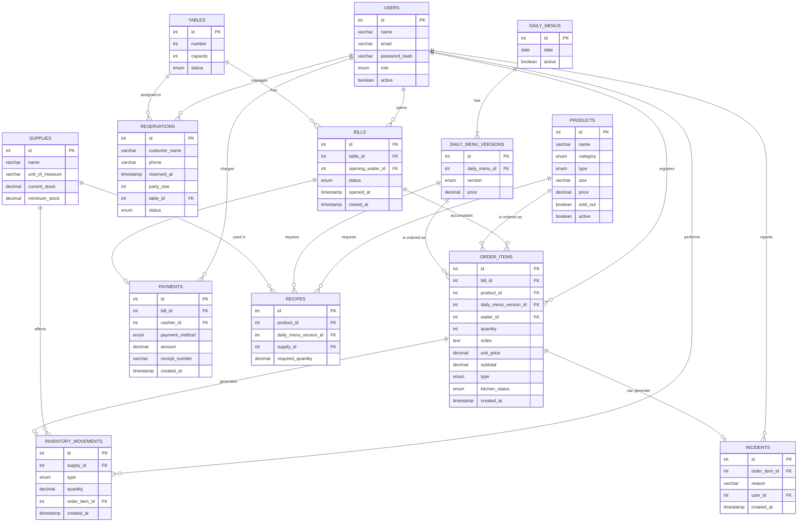

# Entity-Relationship Diagram: Restaurant Web App

```mermaid
erDiagram
    USERS ||--o{ BILLS : "opens"
    USERS ||--o{ ORDER_ITEMS : "registers"
    USERS ||--o{ PAYMENTS : "charges"
    USERS ||--o{ RESERVATIONS : "manages"
    USERS ||--o{ INVENTORY_MOVEMENTS : "performs"
    USERS ||--o{ INCIDENTS : "reports"

    TABLES ||--o{ BILLS : "has"
    TABLES ||--o{ RESERVATIONS : "assigned to"

    BILLS ||--o{ ORDER_ITEMS : "accumulates"
    BILLS ||--o| PAYMENTS : "closes with"

    PRODUCTS ||--o{ ORDER_ITEMS : "is ordered as"
    PRODUCTS ||--o{ RECIPES : "requires"

    DAILY_MENUS ||--|{ DAILY_MENU_VERSIONS : "has"
    DAILY_MENU_VERSIONS ||--o{ ORDER_ITEMS : "is ordered as"
    DAILY_MENU_VERSIONS ||--o{ RECIPES : "requires"

    SUPPLIES ||--o{ RECIPES : "used in"
    SUPPLIES ||--o{ INVENTORY_MOVEMENTS : "affects"

    ORDER_ITEMS ||--o| INVENTORY_MOVEMENTS : "generates"
    ORDER_ITEMS ||--o| INCIDENTS : "can generate"

    USERS {
        int id PK
        varchar name
        varchar email
        varchar password_hash
        enum role
        boolean active
    }

    TABLES {
        int id PK
        int number
        int capacity
        enum status
    }

    BILLS {
        int id PK
        int table_id FK
        int opening_waiter_id FK
        enum status
        timestamp opened_at
        timestamp closed_at
    }

    PRODUCTS {
        int id PK
        varchar name
        enum category
        enum type
        varchar size
        decimal price
        boolean sold_out
        boolean active
    }

    DAILY_MENUS {
        int id PK
        date date
        boolean active
    }

    DAILY_MENU_VERSIONS {
        int id PK
        int daily_menu_id FK
        enum version
        decimal price
    }

    ORDER_ITEMS {
        int id PK
        int bill_id FK
        int product_id FK
        int daily_menu_version_id FK
        int waiter_id FK
        int quantity
        text notes
        decimal unit_price
        decimal subtotal
        enum type
        enum kitchen_status
        timestamp created_at
    }

    PAYMENTS {
        int id PK
        int bill_id FK
        int cashier_id FK
        enum payment_method
        decimal amount
        varchar receipt_number
        timestamp created_at
    }

    SUPPLIES {
        int id PK
        varchar name
        varchar unit_of_measure
        decimal current_stock
        decimal minimum_stock
    }

    RECIPES {
        int id PK
        int product_id FK
        int daily_menu_version_id FK
        int supply_id FK
        decimal required_quantity
    }

    INVENTORY_MOVEMENTS {
        int id PK
        int supply_id FK
        enum type
        decimal quantity
        int order_item_id FK
        timestamp created_at
    }

    RESERVATIONS {
        int id PK
        varchar customer_name
        varchar phone
        timestamp reserved_at
        int party_size
        int table_id FK
        enum status
    }

    INCIDENTS {
        int id PK
        int order_item_id FK
        varchar reason
        int user_id FK
        timestamp created_at
    }
```
